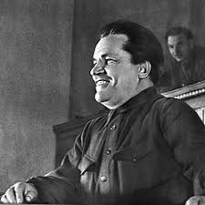

# Creative-projextv2
HI 4613: History of the Soviet Union, Spring 2025     Instructor: Stephen Brain, Ph.D.
<!DOCTYPE html>
<html lang="en">
<head>
    <meta charset="UTF-8">
    <meta name="viewport" content="width=device-width, initial-scale=1.0">
    <title>The Kirov Conspiracy: An Interactive Historical Investigation</title>
    
</head>
<body>
    <!-- Header Section -->
    <header>
        <h1>The Kirov Conspiracy</h1>
        
December 1, 1934: The Murder That Changed Soviet History

    </header>

    <!-- Main Content Section -->
    <main>
        <section id="introduction">
            <h2>Case Overview</h2>
            
On December 1, 1934, Sergei Kirov, the popular Leningrad Party leader, was assassinated in the Smolny Institute. This mysterious murder became the catalyst for Stalin's Great Purge, but historians still debate: Did Stalin orchestrate the killing or merely exploit it?

           
           
        </section>

        <section id="crime-scene">
            <h2>The Crime Timeline</h2>
            

                

                    <h3>4:30 PM, December 1, 1934</h3>
                    
Leonid Nikolayev shoots Kirov in the hallway outside his office at the Smolny Institute

                

                

                    <h3>Within Hours</h3>
                    
Stalin personally takes charge of the investigation

                

                

                    <h3>December 2-29, 1934</h3>
                    
104 "accomplices" executed without trial

                

            

        </section>

        <section id="theories">
            <h2>Competing Theories</h2>
            
            

                <h3>Stalin's Plot</h3>
                
<strong>Evidence:</strong>

                <ul>
                    <li>Kirov was becoming too popular after the 17th Party Congress</li>
                    <li>NKVD officers had detained Nikolayev twice before but released him</li>
                    <li>Kirov's bodyguard Borisov died in a suspicious "accident" before testifying</li>
                </ul>
            

            
            

                <h3>Lone Assassin</h3>
                
<strong>Evidence:</strong>

                <ul>
                    <li>Nikolayev had personal grievances against Party leadership</li>
                    <li>No direct documentary evidence links Stalin to the murder</li>
                    <li>Stalin may have simply exploited the situation after the fact</li>
                </ul>
            

        </section>

        <section id="documents">
            <h2>Key Documents</h2>
            
            

                <h3>NKVD Report (Excerpt)</h3>
                
"The assassin Nikolayev was apprehended at the scene... [REDACTED]... no evidence of wider conspiracy found... [REDACTED]... case closed by order of [REDACTED]."

            

            
            
        </section>

        <section id="aftermath">
            <h2>Historical Consequences</h2>
            
The Kirov assassination became the justification for the Great Purge (1936-1938), during which:

            <ul>
                <li>Over 700,000 people were executed</li>
                <li>Old Bolsheviks like Zinoviev and Kamenev were tried in show trials</li>
                <li>Stalin consolidated absolute power</li>
            </ul>
        </section>
    </main>

    <!-- Footer Section -->
    <footer>
        

            Created by Andrew F. Martin for HI 4613: History of the Soviet Union, Spring 2025. 
            Primary source: Robert Conquest's <i>Stalin and the Kirov Murder</i> (1989) 
            <a href="[https://www.britannica.com/event/Kirov-murder](https://www.history.com/this-day-in-history/december-1/sergey-kirov-murdered)" target="_blank">Learn more at Encyclopedia Britannica</a>
        

    </footer>
</body>
</html>
